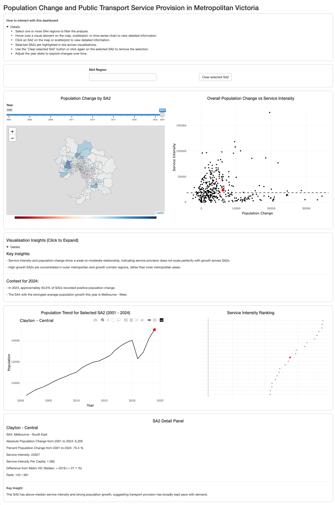

# Melbourne Public Transport & Population Growth

An analysis of how public transport service provision across metropolitan Victoria aligns with historical population growth at the SA2 level.

This project integrates population, public transport and spatial datasets to identify areas where population growth and current public transport service provision may be misaligned. The analysis was extended into an interactive **R Shiny dashboard** with linked visualisations that allow users to explore population change and public transport service intensity across metropolitan Victoria.

## Project Overview

Melbourne's population has grown substantially, but this growth has not occurred evenly across the metropolitan area. This project investigates whether areas experiencing higher population growth are also supported by greater levels of public transport service.

The broader exploratory analysis also examined differences in public transport frequency and coverage across areas with different levels of socioeconomic disadvantage.

### Key Questions

1. Which statistical area level 2 (SA2) regions in metropolitan Victoria have historically had the greatest population growth, and how well do the current public transport services serve these areas?
2. How does public service coverage and frequency vary over different time periods (e.g. time of day/weekends) and how does this service coverage and frequency relate to historically more socioeconomically disadvantaged SA2 regions in metropolitan Victoria?

## Tools & Technologies

**R** · **Shiny** · **tidyverse** · **sf** · **Leaflet** · **Plotly** · **GTFS** · **ABS Census** · **SEIFA**

## Interactive Dashboard

The final R Shiny application allows users to explore population growth and public transport provision across metropolitan Victoria through linked and interactive visualisations.

Key features include:

- Choropleth mapping of population change at the SA2 level
- Comparison of population growth and public transport service intensity
- Interactive SA2 selection across linked visualisations
- Historical population time series for selected areas
- Public transport service-intensity rankings
- SA4 filtering and year selection
- Contextual information for selected SA2s



## Data Sources

| Dataset | Source | Purpose |
| --- | --- | --- |
| [Regional Population Estimates, 2001–2024](https://www.abs.gov.au/statistics/people/population/regional-population/2023-24#data-downloads) | Australian Bureau of Statistics (ABS) | Historical population and population growth at the SA2 level |
| [Victorian GTFS Schedule](https://discover.data.vic.gov.au/dataset/gtfs-schedule) | Victorian Government | Public transport service intensity, frequency and coverage |
| [Census SA2 GeoPackage](https://www.abs.gov.au/census/find-census-data/geopackages?release=2021&geography=VIC&gda=GDA2020&topic=HIHC) | Australian Bureau of Statistics (ABS) | SA2 geographic boundaries and spatial analysis |
| [SEIFA 2021](https://www.abs.gov.au/statistics/people/people-and-communities/socio-economic-indexes-areas-seifa-australia/latest-release)| Australian Bureau of Statistics (ABS) | Socioeconomic disadvantage analysis |

> **Note:** Large raw and intermediate datasets are not included in this repository due to file-size constraints. These datasets can be obtained from their original sources and processed using the scripts provided in the `R/` directory. The large spatial dataset `map_data.rds`, used by the interactive dashboard, is also excluded due to its file size.

## Data Processing & Analysis

The project involved:

- Cleaning and integrating population data covering 2001–2024
- Combining metropolitan train, tram and bus GTFS schedule data
- Joining public transport stops to SA2 geographic boundaries using spatial operations
- Calculating public transport service intensity, frequency and coverage measures
- Integrating SEIFA socioeconomic measures for exploratory analysis
- Preparing specialised datasets for efficient use within the R Shiny application

### Processing Workflow

```text
Raw population, GTFS, spatial and SEIFA data
                    ↓
        data-exploration-code.R
                    ↓
        Cleaned analytical data
                    ↓
       data-visualisation-prep.R
                    ↓
          Shiny-ready datasets
                    ↓
                 app.R
```

## Key Findings

- Population growth between 2001 and 2024 was concentrated in outer metropolitan areas, with Mickleham–Yuroke recording the largest absolute increase of 34,498 residents.
- Most high-growth SA2 regions had public transport service supply per capita below the metropolitan median, suggesting that service provision has not kept pace with population growth in many outer suburban areas.
- Service frequency varied significantly by time of day and day of week, with the highest frequency in the afternoon and on weekdays, while spatial service coverage remained comparatively stable throughout the day.
- Socioeconomic disadvantage showed only a weak relationship with service frequency and coverage, with no statistically significant differences across SEIFA IRSD quartiles.

## Visualisation Design

The dashboard was developed using the **Five Design Sheet (FDS) methodology**, with multiple alternative narrative and visualisation approaches explored before developing the final design.

The design process considered approaches including scrollytelling, drill-down exploration and interactive slideshow structures before combining elements into the final linked multi-view dashboard.

The Five Design Sheets are available in [`docs/five-design-sheets.pdf`](docs/five-design-sheets.pdf).

## Repository Structure

```text
melbourne-public-transport/
│
├── README.md
│
├── app/
│   └── app.R
│
├── R/
│   ├── data-exploration-code.R
│   └── data-visualisation-prep.R
│
├── data/
│   └── processed/
│       ├── rank_data.csv
│       ├── sa2_data.rds
│       └── time_data.csv
│
├── docs/
│   ├── data-exploration-report.pdf
│   ├── visualisation-report.pdf
│   └── five-design-sheets.pdf
│
└── images/
    └── dashboard-overview.png
```

## Reproducing the Project

The smaller processed datasets required by the dashboard are included in the repository. Large source, intermediate and spatial files have been excluded because of their size.

To reproduce the complete data-processing workflow:

1. Download the required population, GTFS, spatial and SEIFA datasets from the sources listed above.
2. Update local input file paths where required.
3. Run `R/data-exploration-code.R` to clean, transform and integrate the source datasets.
4. Run `R/data-visualisation-prep.R` to generate the datasets used by the interactive visualisation.
5. Run `app/app.R` to launch the Shiny application.

> **Note:** `map_data.rds` is not included in this repository due to its file size and must be generated through the data-processing workflow before running the complete dashboard.

## Documentation

More detailed information about the analysis and visualisation development is available in:

- [Data Exploration Report](docs/data-exploration-report.pdf)
- [Visualisation Report](docs/visualisation-report.pdf)
- [Five Design Sheets](docs/five-design-sheets.pdf)

## Limitations

The public transport analysis represents service provision based on the GTFS schedule data used for the project and does not measure actual passenger demand, reliability or real-time service performance.

Population change provides an indication of changing transport needs but does not account for all factors affecting public transport demand. Future analysis could incorporate additional measures such as commuting behaviour, car ownership, accessibility and more detailed socioeconomic characteristics.
